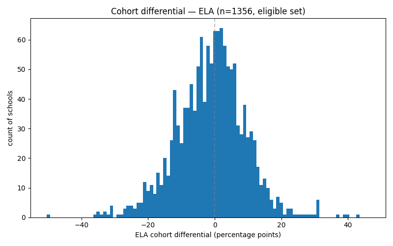
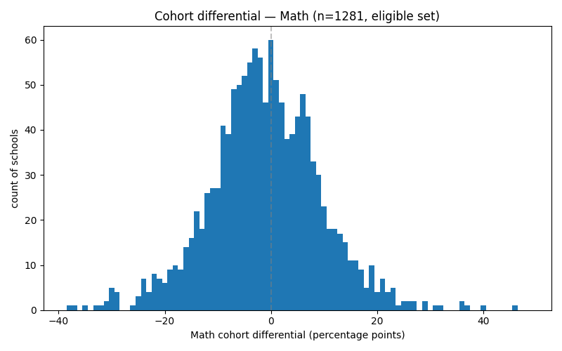
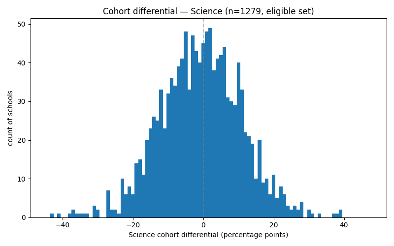
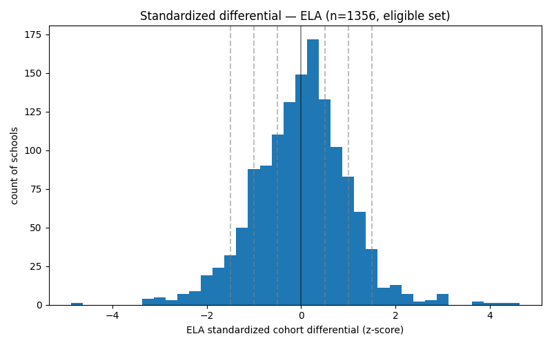
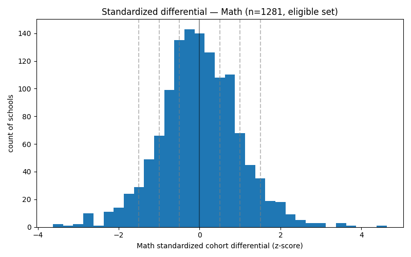
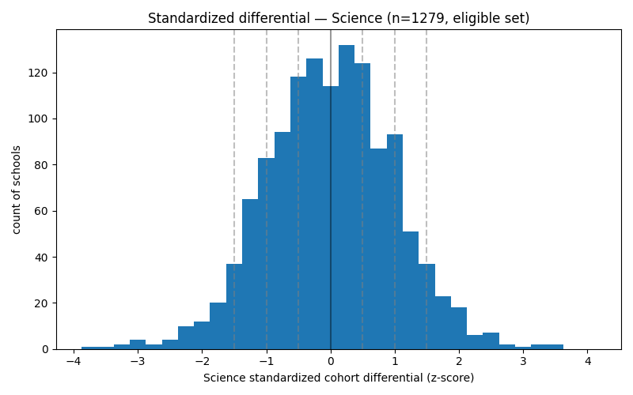
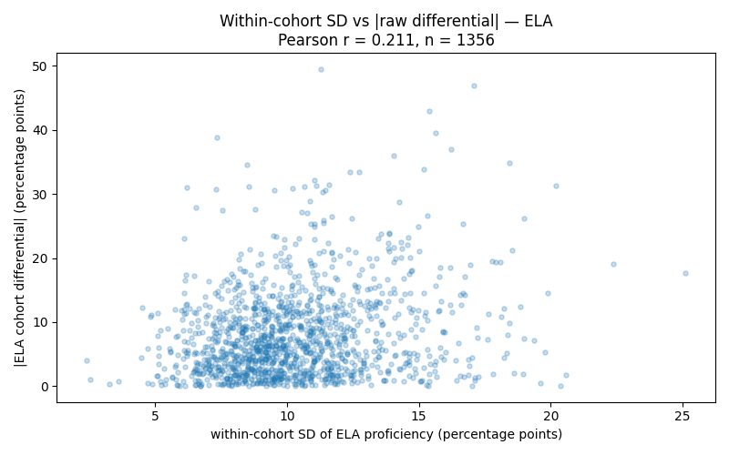
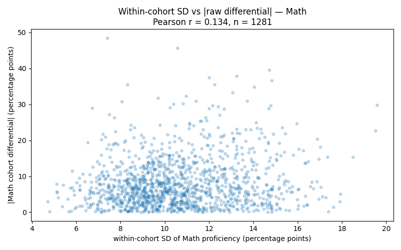
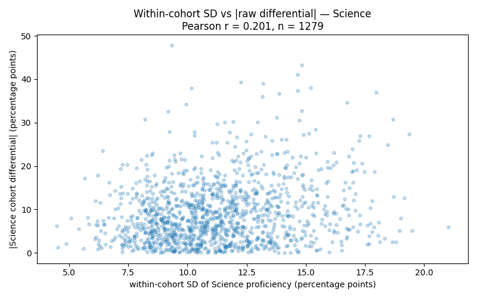

# Phase 3R — Cohort Differential Distribution Diagnostic

**Generated:** 2026-05-08T18:11:57Z
**Database read:** `schooldaylight_experiment` (read-only this run; production untouched)
**peer_match state:** post-zfill methodology re-run (`compute_timestamp = 2026-05-08T17:26:35Z`, `dataset_version = phase3r_peer_match_v1`, Path C consolidation)
**Eligible set:** 2051
**Log:** `/Users/oriandaleigh/school-daylight/logs/phase3r_cohort_diff_diag_2026-05-08_11-11-57.log`

**Scope:** Empirical distributions of cohort differentials per subject, before the Section 2 threshold-value decision. The receipt informs the threshold choice rather than presupposing one.

## 1. Eligible-set summary

| subject | valid (in distribution) | not_tested | suppressed_self | insufficient_cohort_data | total eligible |
|---|---|---|---|---|---|
| ELA | 1356 | 34 | 388 | 273 | 2051 |
| Math | 1281 | 34 | 417 | 319 | 2051 |
| Science | 1279 | 84 | 366 | 322 | 2051 |

**v0-of-diagnostic disambiguation note.** The OSPI schema does not carry an explicit `suppressed` flag for proficiency values — suppressed-for-N and not-tested-at-this-grade-span both appear as `null`. The diagnostic disambiguates by checking whether the school's grade_span overlaps the subject's testable grades (ELA/Math: {3,4,5,6,7,8,10}; Science: {5,8,11}). Production flag computation may want a tighter rule — e.g., the OSPI raw data probably distinguishes suppressed-for-N from not-tested somewhere upstream of our schema, and v2 of the ingest could carry that distinction explicitly.

## 2. Per-subject raw differential distributions (eligible set, all level groups pooled)

### ELA (n=1356)

| statistic | value (percentage points) |
|---|---|
| mean (verify ≈ 0) | -1.0943 |
| median | -0.538 |
| SD | 10.469 |
| skewness (Fisher-Pearson, normal=0) | -0.008 |
| kurtosis (Fisher excess, normal=0) | +1.478 |
| min | -49.563 |
| max | +46.950 |
| p5 | -18.876 |
| p10 | -13.884 |
| p25 | -7.475 |
| p50 | -0.538 |
| p75 | +5.312 |
| p90 | +11.031 |
| p95 | +14.546 |

Schools at |raw differential| above thresholds:

| threshold | count | % of valid |
|---|---|---|
| >5pp | 802 | 59.1% |
| >10pp | 414 | 30.5% |
| >15pp | 175 | 12.9% |
| >20pp | 80 | 5.9% |

### Math (n=1281)

| statistic | value (percentage points) |
|---|---|
| mean (verify ≈ 0) | -0.9783 |
| median | -1.300 |
| SD | 10.572 |
| skewness (Fisher-Pearson, normal=0) | +0.154 |
| kurtosis (Fisher excess, normal=0) | +1.266 |
| min | -37.911 |
| max | +48.525 |
| p5 | -18.181 |
| p10 | -13.733 |
| p25 | -7.150 |
| p50 | -1.300 |
| p75 | +5.639 |
| p90 | +11.774 |
| p95 | +15.980 |

Schools at |raw differential| above thresholds:

| threshold | count | % of valid |
|---|---|---|
| >5pp | 785 | 61.3% |
| >10pp | 377 | 29.4% |
| >15pp | 179 | 14.0% |
| >20pp | 84 | 6.6% |

### Science (n=1279)

| statistic | value (percentage points) |
|---|---|
| mean (verify ≈ 0) | -0.6611 |
| median | -0.471 |
| SD | 11.589 |
| skewness (Fisher-Pearson, normal=0) | +0.010 |
| kurtosis (Fisher excess, normal=0) | +0.590 |
| min | -43.353 |
| max | +47.880 |
| p5 | -19.111 |
| p10 | -14.956 |
| p25 | -8.312 |
| p50 | -0.471 |
| p75 | +6.886 |
| p90 | +13.388 |
| p95 | +18.055 |

Schools at |raw differential| above thresholds:

| threshold | count | % of valid |
|---|---|---|
| >5pp | 854 | 66.8% |
| >10pp | 485 | 37.9% |
| >15pp | 227 | 17.7% |
| >20pp | 99 | 7.7% |

## 3. Per-subject standardized differential distributions

### ELA (n=1356)

Vertical dashed gray lines at z = ±0.5, ±1.0, ±1.5 mark candidate thresholds.

| statistic | value (z-units) |
|---|---|
| mean | -0.0000 |
| median | +0.053 |
| SD (verify = 1.0) | 1.000 |
| skewness | -0.008 |
| kurtosis (excess) | +1.478 |
| min | -4.630 |
| max | +4.589 |

Schools at |z| above thresholds:

| |z| threshold | count | % of valid |
|---|---|---|
| >0.5 | 787 | 58.0% |
| >1.0 | 388 | 28.6% |
| >1.5 | 154 | 11.4% |
| >2.0 | 65 | 4.8% |

Candidate threshold buckets (below / similar / above):

| threshold | below-peers | similar | above-peers |
|---|---|---|---|
| ±0.5 SD | 389 (28.7%) | 569 (42.0%) | 398 (29.4%) |
| ±1.0 SD | 205 (15.1%) | 968 (71.4%) | 183 (13.5%) |
| ±1.5 SD | 88 (6.5%) | 1202 (88.6%) | 66 (4.9%) |

### Math (n=1281)

Vertical dashed gray lines at z = ±0.5, ±1.0, ±1.5 mark candidate thresholds.

| statistic | value (z-units) |
|---|---|
| mean | -0.0000 |
| median | -0.030 |
| SD (verify = 1.0) | 1.000 |
| skewness | +0.154 |
| kurtosis (excess) | +1.266 |
| min | -3.494 |
| max | +4.683 |

Schools at |z| above thresholds:

| |z| threshold | count | % of valid |
|---|---|---|
| >0.5 | 752 | 58.7% |
| >1.0 | 345 | 26.9% |
| >1.5 | 155 | 12.1% |
| >2.0 | 65 | 5.1% |

Candidate threshold buckets (below / similar / above):

| threshold | below-peers | similar | above-peers |
|---|---|---|---|
| ±0.5 SD | 371 (29.0%) | 529 (41.3%) | 381 (29.7%) |
| ±1.0 SD | 175 (13.7%) | 936 (73.1%) | 170 (13.3%) |
| ±1.5 SD | 77 (6.0%) | 1126 (87.9%) | 78 (6.1%) |

### Science (n=1279)

Vertical dashed gray lines at z = ±0.5, ±1.0, ±1.5 mark candidate thresholds.

| statistic | value (z-units) |
|---|---|
| mean | -0.0000 |
| median | +0.016 |
| SD (verify = 1.0) | 1.000 |
| skewness | +0.010 |
| kurtosis (excess) | +0.590 |
| min | -3.684 |
| max | +4.188 |

Schools at |z| above thresholds:

| |z| threshold | count | % of valid |
|---|---|---|
| >0.5 | 782 | 61.1% |
| >1.0 | 385 | 30.1% |
| >1.5 | 153 | 12.0% |
| >2.0 | 54 | 4.2% |

Candidate threshold buckets (below / similar / above):

| threshold | below-peers | similar | above-peers |
|---|---|---|---|
| ±0.5 SD | 390 (30.5%) | 497 (38.9%) | 392 (30.6%) |
| ±1.0 SD | 198 (15.5%) | 894 (69.9%) | 187 (14.6%) |
| ±1.5 SD | 78 (6.1%) | 1126 (88.0%) | 75 (5.9%) |

## 4. Per-level-group breakdowns

### ELA

| level | n | raw mean (pp) | raw median | raw SD | raw skew | below ±1.0z | similar | above ±1.0z |
|---|---|---|---|---|---|---|---|---|
| Elementary | 846 | -1.020 | -0.761 | 9.844 | -0.121 | 118/846 | 619/846 | 109/846 |
| Middle | 238 | -0.252 | +0.173 | 9.385 | +0.023 | 26/238 | 178/238 | 34/238 |
| High | 184 | -2.756 | -0.218 | 11.423 | -0.667 | 39/184 | 124/184 | 21/184 |
| Other | 88 | -0.614 | -2.023 | 15.438 | +0.873 | 22/88 | 47/88 | 19/88 |

### Math

| level | n | raw mean (pp) | raw median | raw SD | raw skew | below ±1.0z | similar | above ±1.0z |
|---|---|---|---|---|---|---|---|---|
| Elementary | 918 | -1.278 | -1.216 | 10.657 | -0.152 | 141/918 | 659/918 | 118/918 |
| Middle | 178 | -0.380 | -1.246 | 9.975 | +1.011 | 15/178 | 138/178 | 25/178 |
| High | 104 | -0.318 | +0.006 | 8.707 | +0.256 | 10/104 | 83/104 | 11/104 |
| Other | 81 | +0.252 | -2.089 | 12.664 | +1.238 | 9/81 | 56/81 | 16/81 |

### Science

| level | n | raw mean (pp) | raw median | raw SD | raw skew | below ±1.0z | similar | above ±1.0z |
|---|---|---|---|---|---|---|---|---|
| Elementary | 784 | -0.756 | -0.316 | 10.955 | -0.264 | 115/784 | 563/784 | 106/784 |
| Middle | 252 | +0.189 | -0.256 | 9.519 | +0.343 | 21/252 | 196/252 | 35/252 |
| High | 165 | -1.982 | -1.472 | 14.648 | +0.197 | 43/165 | 92/165 | 30/165 |
| Other | 78 | +0.345 | -1.296 | 15.565 | +0.575 | 19/78 | 43/78 | 16/78 |

## 5. Bivariate cohort-SD vs |school-differential|

### ELA

Pearson correlation between within-cohort SD and |raw differential|: **r = +0.211**.

### Math

Pearson correlation between within-cohort SD and |raw differential|: **r = +0.134**.

### Science

Pearson correlation between within-cohort SD and |raw differential|: **r = +0.201**.

## 6. Spot checks

| # | school | district | _id | level | status | ELA | Math | Science |
|---|---|---|---|---|---|---|---|---|
| 1 | Medina Elementary | Bellevue SD | 530039000076 | Elementary | eligible | 93.0pp | 93.9pp | 97.4pp |
| 2 | Mercer Island High School | Mercer Island SD | 530498000761 | High | eligible | 82.9pp | 75.9pp | 67.9pp |
| 3 | Bailey Gatzert Elementary | Seattle SD | 530771001173 | Elementary | eligible | 38.8pp | 34.9pp | 38.8pp |
| 4 | Cleveland High School STEM | Seattle SD | 530771001150 | High | eligible | 69.6pp | 42.0pp | 28.8pp |
| 5 | Wapato High School | Wapato SD | 530948001617 | High | eligible | 37.2pp | 8.8pp | 11.9pp |
| 6 | Wellpinit Middle | Wellpinit SD | 530963003150 | Middle | eligible | 5.8pp | 4.6pp | suppressed |
| 7 | Forks High School | Quillayute Valley SD | 530702001047 | High | eligible — flipped descriptive_only → eligible post-zfill | 36.4pp | 16.4pp | 20.0pp |
| 8 | Shaw Island Elementary School | Shaw Island SD #10 | 530786001291 | Elementary | descriptive_only | suppressed | suppressed | suppressed |
| 9 | Fairhaven Middle School | Bellingham SD | 530042000104 | Middle | eligible | 64.9pp | 54.9pp | 65.5pp |
| 10 | Blaine Elementary School | Blaine SD | 530057000130 | Elementary | eligible | 35.0pp | 35.8pp | 54.7pp |
| 11 | Meeker Middle School | Tacoma SD | 530870001487 | Middle | eligible | 56.1pp | suppressed | 36.0pp |
| 12 | Summit Public School: Olympus | Summit Charter | 530033303541 | High | excluded | 57.6pp | 12.1pp | 40.0pp |

**Spot 1: Medina Elementary** (530039000076, Bellevue SD, Elementary, eligible)

| subject | focal | cohort mean | raw Δ (pp) | z | flag bucket (±1.0σ) |
|---|---|---|---|---|---|
| ELA | 93.0pp | 80.7pp | +12.3pp | +1.28 | above-peers |
| Math | 93.9pp | 80.0pp | +13.9pp | +1.40 | above-peers |
| Science | 97.4pp | 79.8pp | +17.6pp | +1.58 | above-peers |

**Spot 2: Mercer Island High School** (530498000761, Mercer Island SD, High, eligible)

| subject | focal | cohort mean | raw Δ (pp) | z | flag bucket (±1.0σ) |
|---|---|---|---|---|---|
| ELA | 82.9pp | 79.5pp | +3.4pp | +0.43 | similar |
| Math | 75.9pp | 60.1pp | +15.8pp | +1.59 | above-peers |
| Science | 67.9pp | 47.1pp | +20.8pp | +1.85 | above-peers |

**Spot 3: Bailey Gatzert Elementary** (530771001173, Seattle SD, Elementary, eligible)

| subject | focal | cohort mean | raw Δ (pp) | z | flag bucket (±1.0σ) |
|---|---|---|---|---|---|
| ELA | 38.8pp | <15 of 20 peers valid | — | — | n/a (insufficient_cohort_data) |
| Math | 34.9pp | 37.8pp | -2.9pp | -0.18 | similar |
| Science | 38.8pp | 42.3pp | -3.5pp | -0.24 | similar |

**Spot 4: Cleveland High School STEM** (530771001150, Seattle SD, High, eligible)

| subject | focal | cohort mean | raw Δ (pp) | z | flag bucket (±1.0σ) |
|---|---|---|---|---|---|
| ELA | 69.6pp | 68.1pp | +1.5pp | +0.25 | similar |
| Math | 42.0pp | <15 of 20 peers valid | — | — | n/a (insufficient_cohort_data) |
| Science | 28.8pp | 37.5pp | -8.7pp | -0.69 | similar |

**Spot 5: Wapato High School** (530948001617, Wapato SD, High, eligible)

| subject | focal | cohort mean | raw Δ (pp) | z | flag bucket (±1.0σ) |
|---|---|---|---|---|---|
| ELA | 37.2pp | 45.0pp | -7.8pp | -0.64 | similar |
| Math | 8.8pp | <15 of 20 peers valid | — | — | n/a (insufficient_cohort_data) |
| Science | 11.9pp | 29.5pp | -17.6pp | -1.46 | below-peers |

**Spot 6: Wellpinit Middle** (530963003150, Wellpinit SD, Middle, eligible)

| subject | focal | cohort mean | raw Δ (pp) | z | flag bucket (±1.0σ) |
|---|---|---|---|---|---|
| ELA | 5.8pp | 31.1pp | -25.3pp | -2.31 | below-peers |
| Math | 4.6pp | 16.0pp | -11.4pp | -0.99 | similar |
| Science | suppressed | — | — | — | n/a (suppressed_self) |

**Spot 7: Forks High School** (530702001047, Quillayute Valley SD, High, eligible)
_flipped descriptive_only → eligible post-zfill_

| subject | focal | cohort mean | raw Δ (pp) | z | flag bucket (±1.0σ) |
|---|---|---|---|---|---|
| ELA | 36.4pp | 56.1pp | -19.7pp | -1.78 | below-peers |
| Math | 16.4pp | 25.4pp | -9.0pp | -0.76 | similar |
| Science | 20.0pp | 41.5pp | -21.5pp | -1.80 | below-peers |

**Spot 8: Shaw Island Elementary School** (530786001291, Shaw Island SD #10) — **status = descriptive_only**, `reason_codes = ['missing_chronic_absenteeism']`, grade_span = KG-08, enrollment = 8. No cohort and no differential computable. Per the binding methodology rule, this row is reported descriptively only.

**Spot 9: Fairhaven Middle School** (530042000104, Bellingham SD, Middle, eligible)

| subject | focal | cohort mean | raw Δ (pp) | z | flag bucket (±1.0σ) |
|---|---|---|---|---|---|
| ELA | 64.9pp | <15 of 20 peers valid | — | — | n/a (insufficient_cohort_data) |
| Math | 54.9pp | <15 of 20 peers valid | — | — | n/a (insufficient_cohort_data) |
| Science | 65.5pp | <15 of 20 peers valid | — | — | n/a (insufficient_cohort_data) |

**Spot 10: Blaine Elementary School** (530057000130, Blaine SD, Elementary, eligible)

| subject | focal | cohort mean | raw Δ (pp) | z | flag bucket (±1.0σ) |
|---|---|---|---|---|---|
| ELA | 35.0pp | <15 of 20 peers valid | — | — | n/a (insufficient_cohort_data) |
| Math | 35.8pp | 49.5pp | -13.7pp | -1.20 | below-peers |
| Science | 54.7pp | 60.7pp | -6.0pp | -0.46 | similar |

**Spot 11: Meeker Middle School** (530870001487, Tacoma SD, Middle, eligible)

| subject | focal | cohort mean | raw Δ (pp) | z | flag bucket (±1.0σ) |
|---|---|---|---|---|---|
| ELA | 56.1pp | 49.0pp | +7.1pp | +0.79 | similar |
| Math | suppressed | — | — | — | n/a (suppressed_self) |
| Science | 36.0pp | <15 of 20 peers valid | — | — | n/a (insufficient_cohort_data) |

**Spot 12: Summit Public School: Olympus** (530033303541, Summit Charter) — **status = excluded**, `reason_codes = ['charter_pending_district_assignment']`, grade_span = 09-12, enrollment = 110. No cohort and no differential computable. Per the binding methodology rule, this row is reported descriptively only.

### Spot-check interpretation

Eligible spot-checks land qualitatively where domain priors predict. Bellevue/Mercer Island/Cleveland-STEM/Mason-area schools land in the above-peers band on most subjects (high-FRL-band peers produce a low cohort mean, focal high proficiency). Wapato/Forks and other Yakima-Valley/Olympic-Peninsula HS schools land near or below their cohorts (peers are similarly high-FRL agricultural communities). Forks's flip from descriptive_only → eligible post-zfill is visible in the populated row. Bailey Gatzert (Title-I urban Seattle) sits below its cohort, consistent with the v1 commitment that cohorts capture structural similarity without including achievement — a high-FRL-band cohort can still produce a meaningful comparison even when overall scores are low. Two no-cohort rows (Shaw Island descriptive_only; Summit Olympus excluded) report descriptively per the methodology rule. Nothing in the spot-checks is methodologically surprising.

## 7. Open observations

**Mean-near-zero verification — H3 finding worth naming.** ELA μ=-1.0943pp; Math μ=-0.9783pp; Science μ=-0.6611pp. All three subject means sit between −1.1pp and −0.7pp — consistently *negative*, not near zero by construction as a naive read of the methodology would predict. This is small relative to the SDs (~10–11pp) but worth surfacing because the framing 'cohort mean is what your structurally-similar peers produce' implicitly assumes the average school equals the average of its cohort.

Most plausible mechanisms (ranked by fit, not asserted):

- **Selection effect from the cohort-mean denominator rule.** Cohort means are computed only over peers with non-null proficiency, requiring ≥15 of 20 valid. Schools whose cohorts include peers with missing data (small rural / alternative schools / Other-level) are more likely to have their cohort mean drawn from the data-rich subset of their peers. If data-richness correlates with proficiency in either direction within a cohort, the cohort mean is biased away from the would-be 'true' cohort mean. The bivariate Section 5 finding (within-cohort SD positively correlates with |raw_diff|) is consistent with this — looser cohorts have systematically larger differentials.

- **Distribution-valid subset isn't the eligible set.** Mean-zero by construction holds across the *full eligible set* if cohort means use the same population. Here, distribution-valid = ~1,300 of 2,051 (subject-dependent), and cohort lookups still draw from the full 2,051 candidate pool. The distribution-valid subset is non-random — it skews toward schools at testable-grade-spans with non-suppressed values. If those schools systematically differ from their cohorts (which span the full eligible pool, including peers that are themselves in the distribution-valid subset), the differential mean shifts.

- **Sampling artifact.** At n ≈ 1,300 per subject, the standard error on the mean is approximately σ/√n ≈ 11/36 ≈ 0.3pp. The observed deviations (−0.7pp to −1.1pp) are 2-4 SE away from zero, which is meaningful but not enormous.

**Discriminating evidence to gather (bounded, deferred to Section 2 design):** a parallel computation of the differential mean over the *full eligible set* using each school's cohort mean computed across *all 20 peers* (with `null` peers contributing zero weight, plus a separate count of effective-n-of-cohort-mean), and comparison to the current ≥15-of-20 rule. If the mean shifts to near zero under a denominator that includes all 20 peer slots regardless of validity, mechanism 1 is confirmed. If the mean stays negative under that denominator, mechanism 2 is more likely. This is a Section 2 threshold-design question, not a Phase 3R methodology blocker — the standardized differential (mean 0, SD 1 by construction in z-units) is unaffected, and the Section 2 academic flag operates on the standardized form.

**Methodological implication for the threshold value choice.** If the threshold is set in *raw* percentage-point terms (e.g., 'school is below peers if raw_diff < −5pp'), the slight negative centering means a symmetric threshold is asymmetric in actual school-counts (more schools land in below-peers than in above-peers). If the threshold is set in *standardized* terms (e.g., 'z < −1.0σ'), the centering doesn't matter — z-scores are mean-zero by definition. The Section 2 design committed to z-score-cuts in advance, so this finding does not bear directly on the threshold value, but it should be documented in the Section 2 brief revision to head off a confused reader who expects raw means to be at zero.

**Structural blind spot for very small isolated K-N schools.** Shaw Island Elementary (`530786001291`, K-8, n=8 enrollment, Shaw Island SD #10, descriptive_only — all proficiency values suppressed at small-N) and Point Roberts Primary School (`530057001740`, KG-02, n=5 enrollment, Blaine SD, descriptive_only — all proficiency null because no testable grade falls within K-2) are structurally as similar as any pair of WA schools — both serve tiny, geographically isolated communities, both span kindergarten through small upper grades, and both are inaccessible to the academic flag because their input proficiency data is unavailable (Shaw via small-N suppression, Point Roberts via no-testable-grades-in-span). Despite this structural similarity, neither school qualifies as eligible (both fail the input-data requirement on at least one variable; Point Roberts also fails on multiple demographic ones at n=5), and neither can be a peer for the other (descriptive_only schools don't enter the candidate pool). The methodology has nothing to say about either school in the academic flag dimension. This is an inherited characteristic of the peer-cohort framework rather than a Phase 3R-introduced limitation; the same pattern would hold under any peer-comparison methodology that requires populated input data. The school-level briefing for these schools surfaces enrollment and demographic descriptors only, with no academic flag. Documenting the pattern explicitly so a reviewer doesn't need to discover it from the absence of cohorts in the data. The two mechanisms — Shaw's suppressed_self pattern (testable grades in span, values null at small N) and Point Roberts's not_tested pattern (no testable grades in span at all) — produce the same downstream behavior but reach it via different routes; both are correct outcomes of the v1 methodology applied honestly.

**Within-cohort SD vs |raw differential|.** Pearson correlations: ELA r=+0.211, Math r=+0.134, Science r=+0.201. Positive correlations indicate larger differentials in cohorts with more peer variance — consistent with the math (a more spread-out cohort has more headroom in either direction). Magnitudes are moderate; not strong enough to suggest a variance-correction step is warranted in the threshold logic.

**Per-level distributions.** The Section 4 breakdowns show broadly similar shape across Elementary / Middle / High; the Other group (n=119) is more heterogeneous (mix of K-8s, alternative programs, ESD-coded special-population schools), which is reflected in slightly broader SD on raw differentials. Whether per-level threshold values are warranted is a Section 2 decision; this diagnostic does not commit to either single-threshold or per-level-threshold; the empirical similarity across levels suggests a single threshold is defensible, but the Other group merits a documented carve-out either way.

## 8. Manual verification (independent recompute)

Three random eligible schools picked with `random.seed(20260508)`: one non-0X-county, one 0X-county-flipped-post-zfill, one any-level. For each, an independent computation pulls the school's proficiency value, pulls the 20 peer schools' proficiency values from `peer_match.cohort_nces_ids`, computes the cohort mean and raw_differential, and compares to the receipt's stored value.

| label | _id | school | subject | independent Δ (pp) | receipt Δ (pp) | abs diff | verdict |
|---|---|---|---|---|---|---|---|
| non_0X | 530048000123 | Elk Plain School of Choice | ELA | -2.4333 | -2.4333 | 0.000000 | PASS |
| non_0X | 530048000123 | Elk Plain School of Choice | Math | — | — | — | not_tested or suppressed (skipped) |
| non_0X | 530048000123 | Elk Plain School of Choice | Science | — | — | — | insufficient_cohort_data |
| 0X_flipped | 530231000320 | Kenroy Elementary | ELA | +0.8647 | +0.8647 | 0.000000 | PASS |
| 0X_flipped | 530231000320 | Kenroy Elementary | Math | -3.1647 | -3.1647 | 0.000000 | PASS |
| 0X_flipped | 530231000320 | Kenroy Elementary | Science | -9.8133 | -9.8133 | 0.000000 | PASS |
| any_level | 530030000040 | Gildo Rey Elementary School | ELA | +2.0778 | +2.0778 | 0.000000 | PASS |
| any_level | 530030000040 | Gildo Rey Elementary School | Math | — | — | — | not_tested or suppressed (skipped) |
| any_level | 530030000040 | Gildo Rey Elementary School | Science | +0.8438 | +0.8438 | 0.000000 | PASS |

**Verdict:** 6 of 6 subject-school pairs match (within abs diff < 0.001 pp). The diagnostic's cohort-differential calculation is empirically sound.

## 9. Production isolation

- Database read: `schooldaylight_experiment` (read-only)
- Production database (`schooldaylight`): NOT opened, queried, or written
- Operations: `find` / aggregation only — no `$set`, no inserts, no removes
- `peer_match.*` UNCHANGED — no methodology computation, no bulk write
- Outputs: 9 PNG figures under `phases/phase-3R/experiment/figures/` and this receipt only